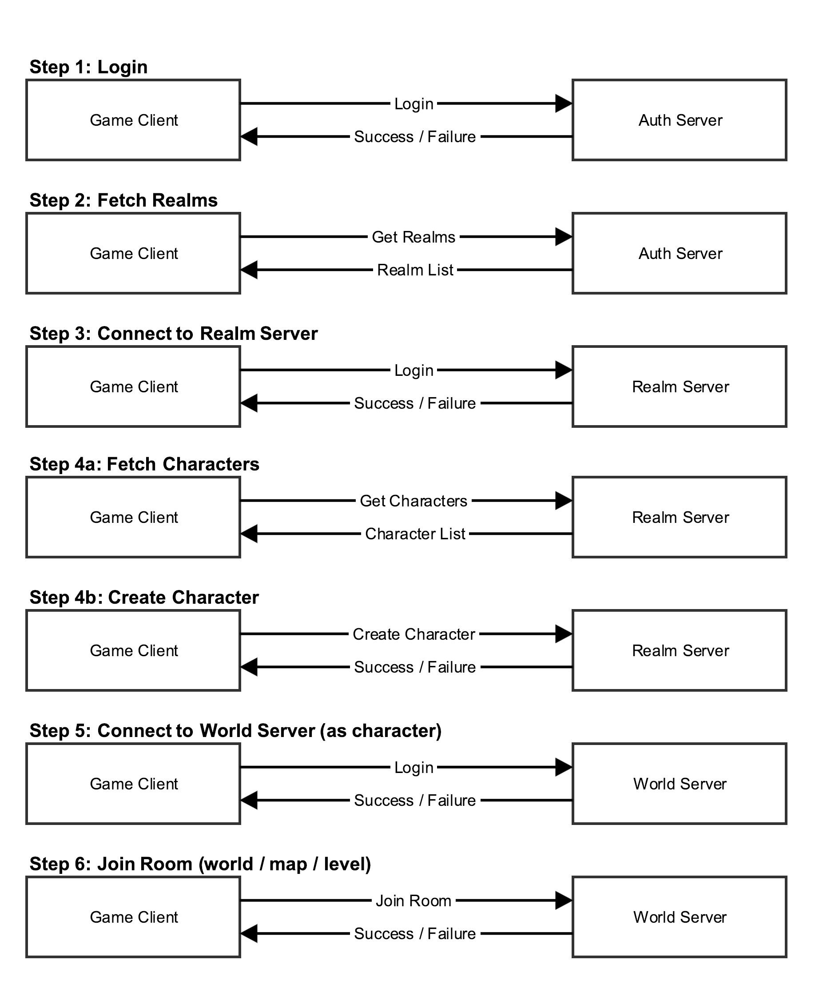
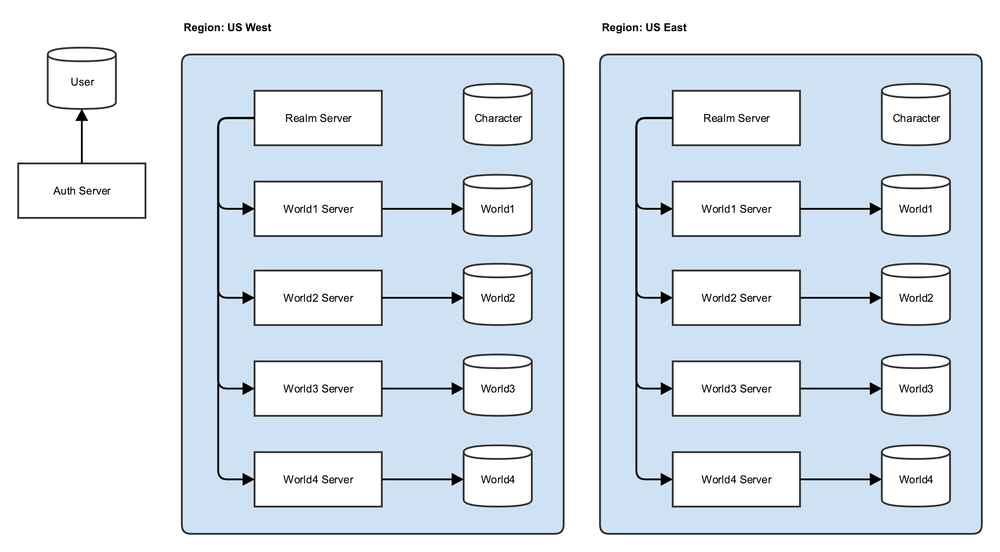

# kotlin-smartfoxserver-demos

## Running

1. You need a working SFS2X instance already
1. `mvn clean package && cp target/DemoExtension.jar PATH-TO-SFS2X/extensions/__lib__`
1. Start the server, load the admin tool
1. Make sure there is a zone called `World`, set the extension to `ZoneExtension`
1. Remove any rooms in World zone (all rooms created via code)
1. Restart server and theoretically it should just work

The server will create `lobby`, `room-1` and `room-2` rooms.

## Architecture

### Logic Flow

This diagram shows how the game client would first connect to the authentication server, which would then provide a list of realms (a game instance, consisting of realm and world servers).

Once authenticated against the auth server, the game client would connect to a realm, which would represent a game. From the realm server, the game client would then connect to a world server which would represent the actual map or level a player's character exists in.

Given the SmartFoxServer 2X architecture, this could be either a single server running the realm (zone) and world (room) servers. Depending on scaling needs, you could have one server/VM/docker container running only a single world to scale out.

